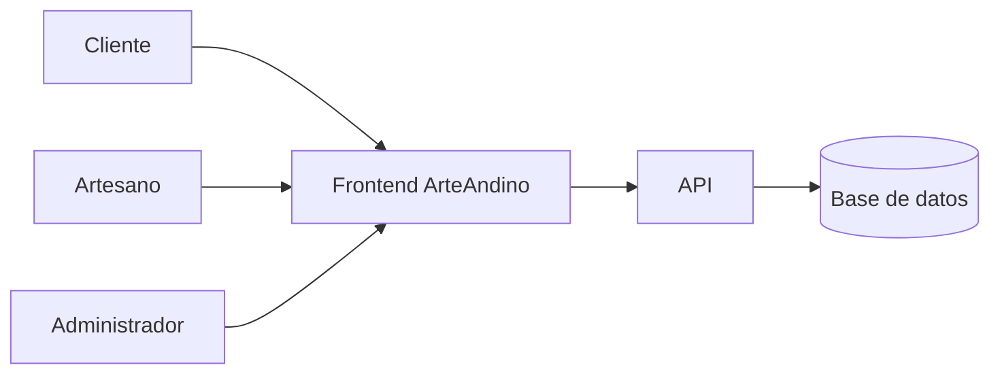

# ArteAndino


ArteAndino es una plataforma web orientada a la comercialización y gestión de artesanías.
Permite que los clientes puedan explorar productos artesanales y que los artesanos administren sus productos, pedidos e inventario.

## Descripción

ArteAndino busca facilitar la conexión entre artesanos y clientes mediante una plataforma digital. El sistema cuenta con diferentes funciones según el tipo de usuario, permitiendo organizar productos, pedidos, inventario y ventas.

## Tabla de contenidos

- [Descripción](#descripción)
- [Instalación](#instalación)
- [Uso](#uso)
- [Estado de funcionalidades](#estado-de-funcionalidades)
- [Tareas pendientes](#tareas-pendientes)
- [Arquitectura](#arquitectura)
- [Contribuidores](#contribuidores)

## Instalación

Para obtener el proyecto, clona el repositorio y accede a la carpeta:

```bash
git clone https://github.com/yamelymachacca-prog/laboratorio-readme.git

cd laboratorio-readme

npm install
```
## Uso

Para iniciar el proyecto, ejecuta el siguiente comando:

```bash
npm run dev
```

Luego abre en el navegador la dirección que aparece en la terminal para acceder a la aplicación.

## Estado de funcionalidades

| Funcionalidad | Estado |
|---|---|
| Inicio de sesión | Listo |
| Catálogo de artesanías | Listo |
| Gestión de productos | Listo |
| Gestión de pedidos | En progreso |
| Control de inventario | En progreso |
| Reportes de ventas | Pendiente |

## Tareas pendientes

- [x] Diseñar las pantallas principales
- [x] Crear el módulo de productos
- [ ] Completar la gestión de pedidos
- [ ] Implementar el control de inventario
- [ ] Desarrollar los reportes de ventas
- [ ] Realizar pruebas del sistema

## Arquitectura



## Contribuidores

- Yamely Machacca Zenayuca - GitHub: yamely.machacca@tecsup.edu.pe